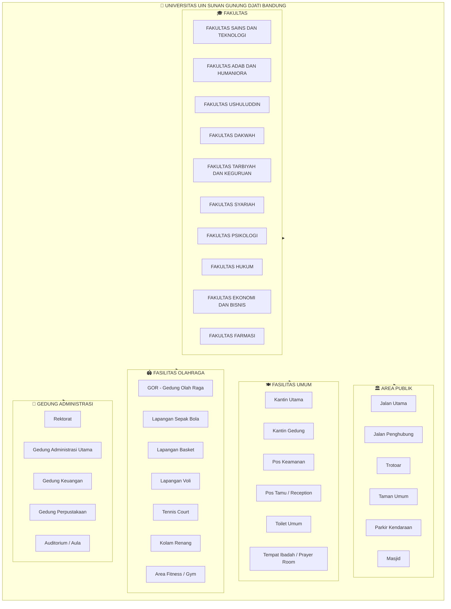
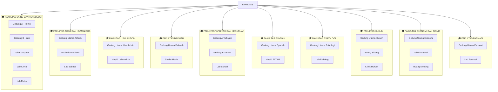
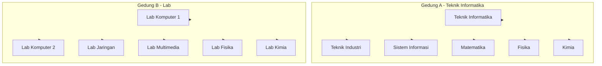
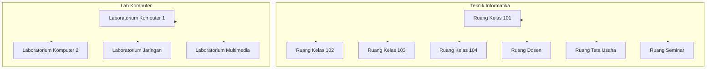
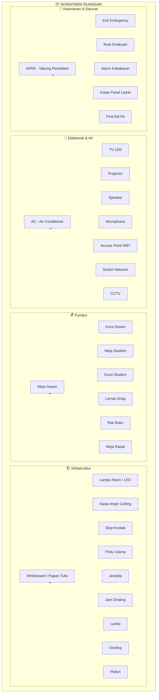

# Decision Tree - Fasilitas Kampus UIN Sunan Gunung Djati Bandung

## Cara Menggunakan
Buka file ini di: https://mermaid.live
Copy paste isi file ini ke editor untuk melihat diagram

---

---

## Level 2: FAKULTAS DAN GEDUNG

---

## Level 3: JURUSAN (Contoh SAINTEK)

---

## Level 4: RUANGAN

---

## Level 5: INVENTARIS / FASILITAS RUANGAN

---

## Ringkasan Struktur Decision Tree

| Level | Type | Contoh |
|-------|------|--------|
| 1 | UNIVERSITAS | UIN Sunan Gunung Djati Bandung |
| 2 | AREA PUBLIK | Jalan, Taman, Parkir, Masjid |
| 3 | FASILITAS UMUM | Kantin, Pos Keamanan, Toilet |
| 4 | OLAHRAGA | GOR, Lapangan, Kolam Renang |
| 5 | ADMINISTRASI | Rektorat, Perpustakaan |
| 6 | FAKULTAS | Saintek, Adhum, Tarbiyah, dll |
| 7 | GEDUNG | Gedung A, Gedung B |
| 8 | JURUSAN | Teknik Informatika, PGMI |
| 9 | RUANGAN | Ruang Kelas 101, Lab Komputer |
| 10 | INVENTARIS | AC, TV, Meja, Kursi, dll |