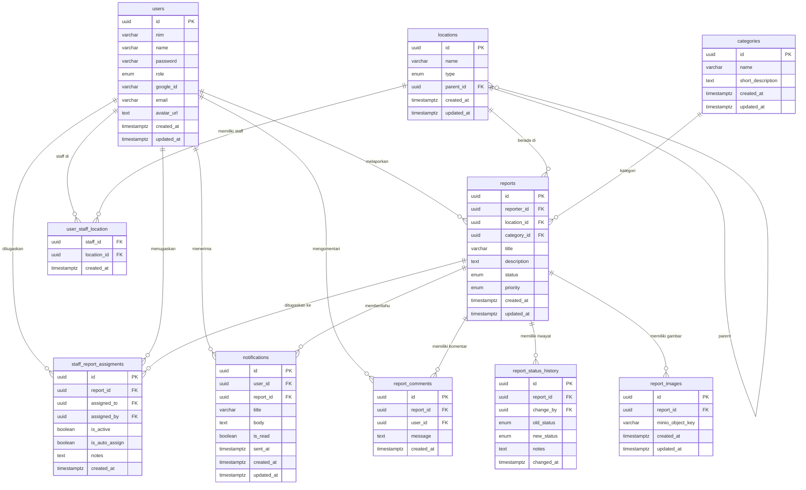

# Entity Relationship Diagram (ERD)
## SILAPOR v2

---

## Entity Overview

| No | Tabel | Deskripsi |
|----|-------|-----------|
| 1 | users | Data pengguna (Mahasiswa, Staff, Admin) |
| 2 | locations | Hierarki lokasi kampus |
| 3 | categories | Kategori kerusakan |
| 4 | reports | Laporan kerusakan utama |
| 5 | report_images | Gambar laporan (disimpan di MinIO) |
| 6 | report_status_history | Riwayat perubahan status |
| 7 | report_comments | Komentar pada laporan |
| 8 | staff_report_assigments | Assignment staff ke laporan |
| 9 | user_staff_location | Mapping staff ke lokasi |
| 10 | notifications | Notifikasi pengguna |

---

## Entity Details

### 1. users

| Kolom | Tipe | Keterangan |
|-------|------|------------|
| id | UUID (PK) | Primary key |
| nim | VARCHAR(255) | Nomor induk mahasiswa (unique) |
| name | VARCHAR(255) | Nama lengkap |
| password | VARCHAR(255) | Hash bcrypt (NULL untuk Google user) |
| role | ENUM('MAHASISWA','STAFF','ADMIN') | Role pengguna |
| google_id | VARCHAR(255) | Google OAuth ID (nullable) |
| email | VARCHAR(255) | Email (nullable) |
| avatar_url | TEXT | Foto profil Google |
| created_at | TIMESTAMPTZ | Waktu dibuat |
| updated_at | TIMESTAMPTZ | Waktu diupdate |

### 2. locations

| Kolom | Tipe | Keterangan |
|-------|------|------------|
| id | UUID (PK) | Primary key |
| name | VARCHAR(255) | Nama lokasi |
| type | ENUM('UNIVERSITAS','FAKULTAS','JURUSAN','RUANGAN','AREA') | Tipe lokasi |
| parent_id | UUID (FK → locations.id) | Parent lokasi (self-referencing) |
| created_at | TIMESTAMPTZ | Waktu dibuat |
| updated_at | TIMESTAMPTZ | Waktu diupdate |

### 3. categories

| Kolom | Tipe | Keterangan |
|-------|------|------------|
| id | UUID (PK) | Primary key |
| name | VARCHAR(255) | Nama kategori |
| short_description | TEXT | Deskripsi singkat |
| created_at | TIMESTAMPTZ | Waktu dibuat |
| updated_at | TIMESTAMPTZ | Waktu diupdate |

### 4. reports

| Kolom | Tipe | Keterangan |
|-------|------|------------|
| id | UUID (PK) | Primary key |
| reporter_id | UUID (FK → users.id) | Pelapor |
| location_id | UUID (FK → locations.id) | Lokasi kerusakan |
| category_id | UUID (FK → categories.id) | Kategori kerusakan |
| title | VARCHAR(255) | Judul laporan |
| description | TEXT | Deskripsi kerusakan |
| status | ENUM('menunggu','diterima','diproses','selesai','ditolak') | Status |
| priority | ENUM('rendah','sedang','tinggi') | Prioritas |
| created_at | TIMESTAMPTZ | Waktu dibuat |
| updated_at | TIMESTAMPTZ | Waktu diupdate |

### 5. report_images

| Kolom | Tipe | Keterangan |
|-------|------|------------|
| id | UUID (PK) | Primary key |
| report_id | UUID (FK → reports.id) | Laporan terkait |
| minio_object_key | VARCHAR(255) | Key di MinIO |
| created_at | TIMESTAMPTZ | Waktu dibuat |
| updated_at | TIMESTAMPTZ | Waktu diupdate |

### 6. report_status_history

| Kolom | Tipe | Keterangan |
|-------|------|------------|
| id | UUID (PK) | Primary key |
| report_id | UUID (FK → reports.id) | Laporan terkait |
| change_by | UUID (FK → users.id) | Pengubah |
| old_status | report_status | Status sebelumnya |
| new_status | report_status | Status baru |
| notes | TEXT | Catatan perubahan |
| changed_at | TIMESTAMPTZ | Waktu perubahan |

### 7. report_comments

| Kolom | Tipe | Keterangan |
|-------|------|------------|
| id | UUID (PK) | Primary key |
| report_id | UUID (FK → reports.id) | Laporan terkait |
| user_id | UUID (FK → users.id) | Pengomentar |
| message | TEXT | Isi komentar |
| created_at | TIMESTAMPTZ | Waktu dibuat |

### 8. staff_report_assigments

| Kolom | Tipe | Keterangan |
|-------|------|------------|
| id | UUID (PK) | Primary key |
| report_id | UUID (FK → reports.id) | Laporan |
| assigned_to | UUID (FK → users.id) | Staff tujuan |
| assigned_by | UUID (FK → users.id) | Pemberi tugas |
| is_active | BOOLEAN | Status aktif |
| is_auto_assign | BOOLEAN | Auto/manual |
| notes | TEXT | Catatan |
| created_at | TIMESTAMPTZ | Waktu dibuat |

### 9. user_staff_location

| Kolom | Tipe | Keterangan |
|-------|------|------------|
| staff_id | UUID (FK → users.id) | Staff |
| location_id | UUID (FK → locations.id) | Lokasi |
| created_at | TIMESTAMPTZ | Waktu dibuat |

### 10. notifications

| Kolom | Tipe | Keterangan |
|-------|------|------------|
| id | UUID (PK) | Primary key |
| user_id | UUID (FK → users.id) | Penerima |
| report_id | UUID (FK → reports.id) | Laporan terkait |
| title | VARCHAR(255) | Judul notifikasi |
| body | TEXT | Isi notifikasi |
| is_read | BOOLEAN | Status baca |
| sent_at | TIMESTAMPTZ | Waktu dikirim |
| created_at | TIMESTAMPTZ | Waktu dibuat |
| updated_at | TIMESTAMPTZ | Waktu diupdate |

---

## Relationships & Cardinality

| Source | Relation | Target | Cardinality |
|--------|----------|--------|-------------|
| users | 1 ——< | reports | One to Many |
| users | 1 ——< | report_comments | One to Many |
| users | 1 ——< | notifications | One to Many |
| users | 1 ——< | staff_report_assigments (as staff) | One to Many |
| locations | 1 ——< | reports | One to Many |
| locations | 1 ——< | locations (self: parent_id) | One to Many |
| locations | 1 ——< | user_staff_location | One to Many |
| categories | 1 ——< | reports | One to Many |
| reports | 1 ——< | report_images | One to Many |
| reports | 1 ——< | report_status_history | One to Many |
| reports | 1 ——< | report_comments | One to Many |
| reports | 1 ——< | staff_report_assigments | One to Many |
| reports | 1 ——< | notifications | One to Many |
| users | 1 ——< | user_staff_location | One to Many |

---

## Entity Relationship Diagram (Mermaid)

