# Use Case (UC)
## SILAPOR v2

---

## Aktor

| Aktor | Deskripsi |
|-------|-----------|
| **Mahasiswa** | Pengguna yang melaporkan kerusakan fasilitas kampus |
| **Staff** | Petugas yang menangani dan memperbaiki kerusakan |
| **Admin** | Pengelola sistem dengan akses penuh |
| **Google OAuth** | Sistem autentikasi eksternal |
| **Sistem** | SILAPOR v2 (auto-assign, notifikasi) |

---

## Daftar Use Case

| ID | Use Case | Aktor Utama | Prioritas |
|----|----------|-------------|-----------|
| UC-01 | Registrasi Akun | Mahasiswa | Tinggi |
| UC-02 | Login NIM/Password | Mahasiswa, Staff, Admin | Tinggi |
| UC-03 | Login Google OAuth | Mahasiswa, Staff, Admin | Tinggi |
| UC-04 | Logout | Mahasiswa, Staff, Admin | Tinggi |
| UC-05 | Refresh Token | Mahasiswa, Staff, Admin | Tinggi |
| UC-06 | Buat Laporan Kerusakan | Mahasiswa | Tinggi |
| UC-07 | Upload Gambar Laporan | Mahasiswa | Tinggi |
| UC-08 | Lihat Laporan Saya | Mahasiswa | Tinggi |
| UC-09 | Lihat Semua Laporan | Staff, Admin | Tinggi |
| UC-10 | Lihat Detail Laporan | Mahasiswa, Staff, Admin | Tinggi |
| UC-11 | Update Status Laporan | Staff, Admin | Tinggi |
| UC-12 | Update Laporan (edit) | Mahasiswa | Sedang |
| UC-13 | Hapus Laporan | Mahasiswa, Admin | Rendah |
| UC-14 | Lihat Riwayat Status | Mahasiswa, Staff, Admin | Sedang |
| UC-15 | Komentar Laporan | Mahasiswa, Staff, Admin | Sedang |
| UC-16 | Auto-Assign Staff | Sistem | Tinggi |
| UC-17 | Manual Assign Staff | Admin | Sedang |
| UC-18 | Transfer Assignment | Admin, Staff | Sedang |
| UC-19 | Lihat Task Saya | Staff | Tinggi |
| UC-20 | Lihat Hierarki Lokasi | Mahasiswa, Staff, Admin | Tinggi |
| UC-21 | Kelola Lokasi (CRUD) | Admin | Sedang |
| UC-22 | Kelola Kategori (CRUD) | Admin | Sedang |
| UC-23 | Lihat Notifikasi | Mahasiswa, Staff, Admin | Sedang |
| UC-24 | Tandai Notifikasi Dibaca | Mahasiswa, Staff, Admin | Sedang |
| UC-25 | Dashboard Admin | Admin | Tinggi |
| UC-26 | Dashboard Staff | Staff | Tinggi |
| UC-27 | Manajemen Staff (CRUD) | Admin | Sedang |
| UC-28 | Manajemen User (CRUD) | Admin | Sedang |
| UC-29 | Assign Staff ke Lokasi | Admin | Sedang |
| UC-30 | Lihat Profil | Mahasiswa, Staff, Admin | Rendah |
| UC-31 | Statistik Laporan | Admin | Sedang |

---

## Detail Use Case Terpilih

### UC-01: Registrasi Akun

| Elemen | Detail |
|--------|--------|
| **Aktor** | Mahasiswa |
| **Pre-condition** | Belum memiliki akun |
| **Post-condition** | Akun terdaftar dengan role MAHASISWA |
| **Alur Utama** | 1. Mahasiswa input NIM, nama, password 2. Sistem validasi (NIM unik, field wajib) 3. Sistem hash password (bcrypt) 4. Sistem simpan user dengan role MAHASISWA 5. Sistem return sukses |
| **Alur Alternatif** | 2a. NIM sudah terdaftar → error 409 2b. Field kosong → error 400 |

### UC-02: Login NIM/Password

| Elemen | Detail |
|--------|--------|
| **Aktor** | Mahasiswa, Staff, Admin |
| **Pre-condition** | Akun sudah terdaftar |
| **Post-condition** | User mendapatkan accessToken + refreshToken |
| **Alur Utama** | 1. User input NIM + password 2. Sistem verifikasi kredensial 3. Sistem generate accessToken (15m) + refreshToken (7d) 4. Sistem set refreshToken di httpOnly cookie 5. Sistem return accessToken + data user |
| **Alur Alternatif** | 2a. NIM/password salah → error 401 2b. Akun terdaftar via Google → error 400 |

### UC-06: Buat Laporan Kerusakan

| Elemen | Detail |
|--------|--------|
| **Aktor** | Mahasiswa |
| **Pre-condition** | Sudah login, lokasi & kategori tersedia |
| **Post-condition** | Laporan tersimpan, staff auto-assigned, notifikasi terkirim |
| **Alur Utama** | 1. Mahasiswa pilih lokasi kerusakan 2. Mahasiswa pilih kategori 3. Mahasiswa input judul & deskripsi 4. Mahasiswa upload foto (opsional) 5. Mahasiswa submit 6. Sistem simpan laporan (status: menunggu) 7. Sistem simpan gambar ke MinIO 8. Sistem auto-assign staff berdasarkan lokasi 9. Sistem kirim notifikasi ke staff 10. Sistem return sukses |
| **Alur Alternatif** | 5a. Field wajib kosong → error 400 5b. Upload gagal → error 500 |

### UC-11: Update Status Laporan

| Eleumen | Detail |
|--------|--------|
| **Aktor** | Staff, Admin |
| **Pre-condition** | Laporan exist, user punya akses |
| **Post-condition** | Status berubah, history tercatat, notifikasi terkirim |
| **Alur Utama** | 1. Staff pilih laporan 2. Staff pilih status baru (diterima/diproses/selesai/ditolak) 3. Staff input catatan (opsional) 4. Sistem validasi transisi status 5. Sistem update status laporan 6. Sistem simpan ke report_status_history 7. Sistem kirim notifikasi ke reporter 8. Sistem return sukses |
| **Alur Alternatif** | 4a. Transisi status tidak valid → error 400 |

### UC-16: Auto-Assign Staff

| Elemen | Detail |
|--------|--------|
| **Aktor** | Sistem |
| **Pre-condition** | Laporan baru dibuat |
| **Post-condition** | Staff ter-assign ke laporan |
| **Alur Utama** | 1. Sistem ambil location_id dari laporan 2. Sistem cari staff di lokasi tersebut 3. Jika tidak ada, naik ke parent location 4. Ulangi sampai staff ditemukan atau root 5. Jika staff ditemukan, buat assignment (is_auto_assign=true) 6. Kirim notifikasi ke staff |
| **Alur Alternatif** | 4a. Staff tidak ditemukan → assignment null (admin assign manual) |

### UC-25: Dashboard Admin

| Eleumen | Detail |
|--------|--------|
| **Aktor** | Admin |
| **Pre-condition** | Admin sudah login |
| **Post-condition** | Menampilkan statistik |
| **Alur Utama** | 1. Sistem hitung total laporan 2. Sistem hitung breakdown per status 3. Sistem hitung data mingguan (trend) 4. Sistem hitung persentase perubahan 5. Sistem return semua data statistik 6. Tampilkan di AdminOverview page |

---

## Diagram Use Case (Mermaid)

```mermaid
graph TD
    subgraph Aktor
        A[Mahasiswa]
        B[Staff]
        C[Admin]
        D[Sistem]
    end

    subgraph Use_Case
        UC01[UC-01 Registrasi]
        UC02[UC-02 Login NIM/Password]
        UC03[UC-03 Login Google OAuth]
        UC04[UC-04 Logout]
        UC05[UC-05 Refresh Token]
        UC06[UC-06 Buat Laporan]
        UC07[UC-07 Upload Gambar]
        UC08[UC-08 Lihat Laporan Saya]
        UC09[UC-09 Lihat Semua Laporan]
        UC10[UC-10 Detail Laporan]
        UC11[UC-11 Update Status]
        UC14[UC-14 Riwayat Status]
        UC15[UC-15 Komentar]
        UC16[UC-16 Auto-Assign]
        UC17[UC-17 Manual Assign]
        UC18[UC-18 Transfer]
        UC19[UC-19 Lihat Task]
        UC20[UC-20 Lihat Lokasi]
        UC21[UC-21 Kelola Lokasi]
        UC22[UC-22 Kelola Kategori]
        UC23[UC-23 Notifikasi]
        UC24[UC-24 Baca Notifikasi]
        UC25[UC-25 Dashboard Admin]
        UC26[UC-26 Dashboard Staff]
        UC27[UC-27 Manajemen Staff]
        UC28[UC-28 Manajemen User]
        UC29[UC-29 Assign Staff Lokasi]
        UC30[UC-30 Lihat Profil]
        UC31[UC-31 Statistik]
    end

    A --> UC01
    A --> UC02
    A --> UC03
    A --> UC04
    A --> UC05
    A --> UC06
    A --> UC07
    A --> UC08
    A --> UC10
    A --> UC14
    A --> UC15
    A --> UC20
    A --> UC23
    A --> UC24
    A --> UC30

    B --> UC02
    B --> UC03
    B --> UC04
    B --> UC05
    B --> UC09
    B --> UC10
    B --> UC11
    B --> UC14
    B --> UC15
    B --> UC18
    B --> UC19
    B --> UC20
    B --> UC23
    B --> UC24
    B --> UC26
    B --> UC30

    C --> UC02
    C --> UC03
    C --> UC04
    C --> UC05
    C --> UC09
    C --> UC10
    C --> UC11
    C --> UC14
    C --> UC15
    C --> UC17
    C --> UC18
    C --> UC20
    C --> UC21
    C --> UC22
    C --> UC23
    C --> UC24
    C --> UC25
    C --> UC27
    C --> UC28
    C --> UC29
    C --> UC30
    C --> UC31

    D --> UC16
```

